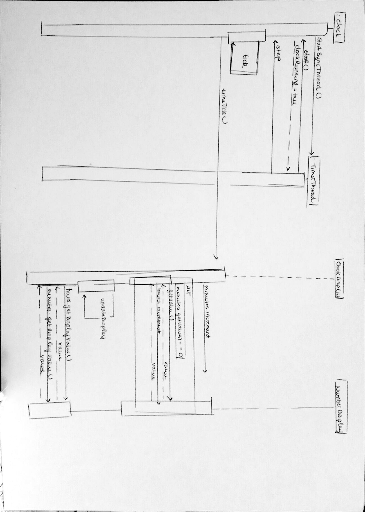
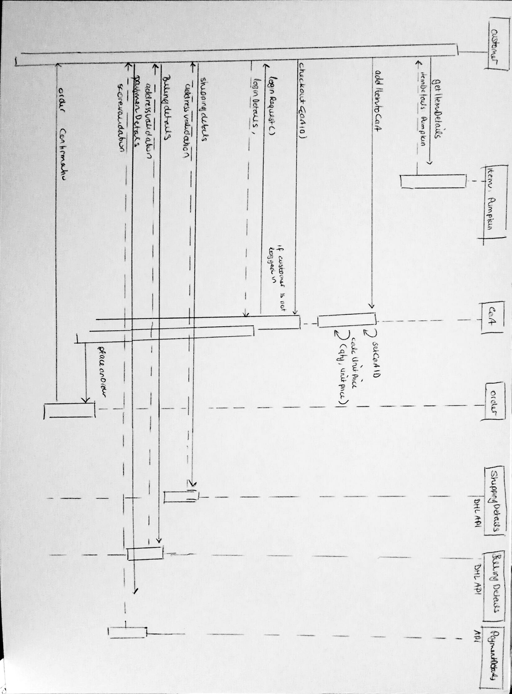
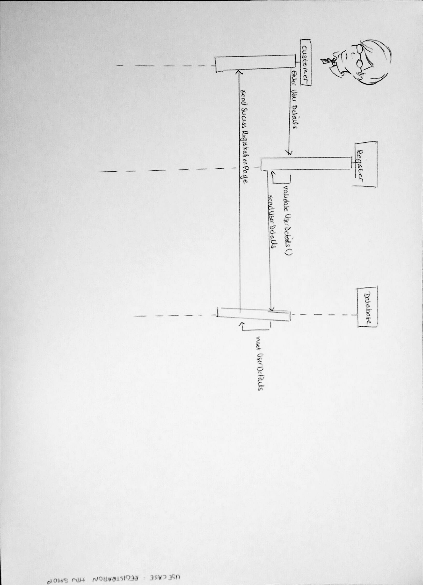
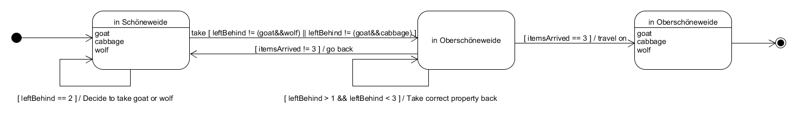
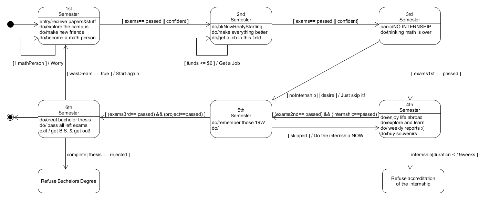

# Lab Report 03
## Assignment 03 - Sequence Diagrams and State Machine Diagrams
_Authors: Dennis Loska, Tony Dorfmeister, Ai Dong 27.11.2017_

## Part 1: Sequence Diagrams
**Assignment**

#### As a finger exercise for Sequence Diagrams, pick one of the following example projects from the first semester and draw a sequence diagram for the main use case:

 - The Clock Display / Use case: timeTick() is called
 - Auction / Use case: makeABid() is called
 - Tech Support / Use case: user command is entered (start() method in SupportSystem)
 - The Zuul Project / Use case: user enters command (method: play() in Game.java)

Von den obern gennanten Use Cases haben wir uns für **timeTick()** entschieden:

**HIER KOMMT DEIN KONTENT REIN AI!!!!!**

#### Now take your scenarios from the second exercise and have a good look at them. There are a number of processes that you should have detailed in your scenarios - if not, now you learn how to be thorough :) You need to draw sequence diagrams for the following use cases:

- Ordering a Pumpkin/Treat
- one other use case of your choosing

#### Ordering a Pumpkin/Treat

**HIER KOMMT DEIN KONTENT REIN AI!!!!!**

#### Registration at the HTW Shop
Neben dem Use Case "Ordering a Pumpkin/Treat" haben wir uns außerdem für ein Use Case entschieden, welches die Registrierung eines Users im HTW-Shop beschreibt.

**HIER KOMMT DEIN KONTENT REIN AI!!!!!**

## Part 2: State Machine Diagrams

#### Model the modified goat/cabbage/wolf problem: The farmer is in Schöneweide and wants to get his goat, his cabbage and his wolf over to Oberschöneweide. Only one thing can fit in his boat at a time beside himself. He cannot leave the cabbage and the goat or the goat and the wolf alone on the same side of the river, for obvious reasons. Is it possible for him to get all three possessions across the Spree? Draw a State Machine Diagram modelling both solutions to this problem.

**Beschreibung folgt hier noch...**

#### Model the states an IMI student passes through from the first until the sixth semester. (Special prize for the most humorous model that is not offensive.)

**Beschreibung folgt hier noch...**

#### Model the states of a parser that determines if a given string is a proper floating-point number.

Der Parser besitzt die folgenden Zustände:

- String
- ByteArray
- parseChars
- notAFloat

Zuerst wird ein String in ein ByteArray konvertiert. Dieses ByteArray wird durchlaufen. Währenddessen wird überprüft ob der derzeitige Character auf seinen Typ überprüft. Ist der Character entweder ein Buchstabe, Sonderzeichen, NULL oder leer handelt es sich um keinen Floating-Point-Value. Handelt es um eine Ziffer oder einen Punkt ruft sich der Zustand selbst auf und der Index wird erhöht bis eine andere Bedingung erfüllt ist. Ist der Index gleich der Länge des Arrays haben wir das gesamte Array durchlaufen und es handelt sich um einen Floating-Point-Value.

#### Model the states a Pumpkin order in the HTW system can be in.

Das HTW System besitz die folgenden Zustände:

- Item in Cart
- pending
- cancelled
- Shipping

Zunächst muss sich der zu erwerbende Gegenstand in der Cart befinden. Von hieraus kann der User den Gegenstand bezahlen womit die Bestellung den Zustand *pending* erhält. Ist die Bezahlung nicht erfolgreich wandert der Gegenstand zurück in die Cart. Ist der Gegenstand zur Zeit nicht auf Lager bleibt die Bestellung solange im Zustand *pending* bis der Gegenstand wieder vorrätig ist. Möchte der User die Bestellung stornieren erhält die Bestellung den Zustand *cancelled* und das System ist beendet. Sind beide Bedingungen erfolgreich erhält die Bestellung den Zustand *shipping*. Konnte der Gegenstand nicht zugestellt werden erhält die Bestellung erneut den Zustand *pending*. Auch in diesem Zustand hat der User noch die Möglichkeit die Bestellung zu stornieren. War die Lieferung jedoch erfolgreich, hat das System seinen finalen Zustand erreicht.

